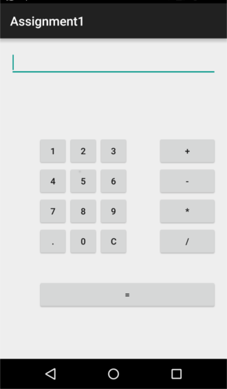
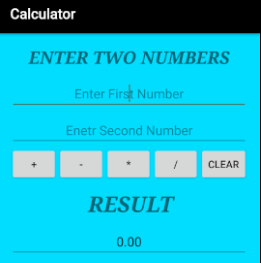

# Beginners Task

Week 1 Task
---------------

Installation of Android Studio and basic Introduction of Git version control.

### Details

Android Studio is the official integrated development environment for Google's Android operating system, built on JetBrains' IntelliJ IDEA software and designed specifically for Android development.

We will work you through on how to install Android Studio.

[You can visit this link to start](https://developer.android.com/studio/ "Android Studio").

Git is a version-control system for tracking changes in computer files and coordinating work on those files among multiple people. It is primarily used for source-code management in software development, but it can be used to keep track of changes in any set of files.

We will work you through on how to install, configure and start using Git Version Control System.

[You can visit this link to start](https://git-scm.com/ "Git version control").

Week 2 Task (Calculator Layout)
---------------

The task here is to build an interface that looks exactly like a calculator using any of the layouts stated below.

### Details 

XML stands for **Extensible Markup Language.** XML is a markup language much like HTML used to describe data. XML tags are not predefined in XML. In Android we use XML for designing our layouts because xml is lightweight language so it doesn’t make our layout heavy.

The different types of layout in android are Linear Layout, Relative Layout, Constraint Layout,Table Layout and Frame Layout.

### Learning Outcomes

• Familiarization with Android Studio development environment.
• Create a one screen android app
• Create new Android projects
• Connect XML widgets to code
• Deploy your app to a physical device
