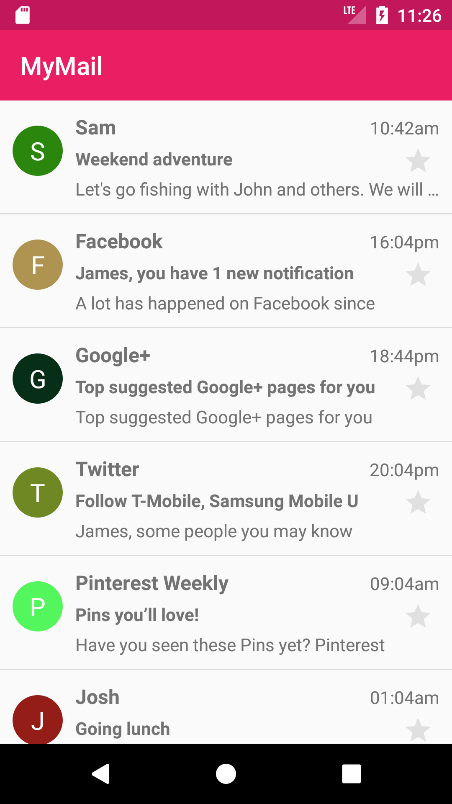

# Intermediate Task

Week 1 Task
---------------

Installation of Android Studio and basic Introduction of Git version control.

### Details

Android Studio is the official integrated development environment for Google's Android operating system, built on JetBrains' IntelliJ IDEA software and designed specifically for Android development.

We will work you through on how to install Android Studio.

[You can visit this link to start](https://developer.android.com/studio/ "Android Studio").

Git is a version-control system for tracking changes in computer files and coordinating work on those files among multiple people. It is primarily used for source-code management in software development, but it can be used to keep track of changes in any set of files.

We will work you through on how to install, configure and start using Git Version Control System.

[You can visit this link to start](https://git-scm.com/ "Git version control").

Week 2 Task (Contact list)
---------------

The task here is to build an interface/app that displays list of contacts in recyclerview or listview.

Things to contain:
1. Name
2. Phone number
3. Address

## Details 
A **recycler view** is like a new kind of list view A recycler view gets its name because it can efficiently reuse (or recycle) views to create the appearance of a list on the screen. A recycler view can be used to display card views.

### Learning Outcomes

• Familiarization with Android Studio development environment.
• Create a one screen android app
• Create new Android projects
• Connect XML widgets to code
• Deploy your app to a physical device
